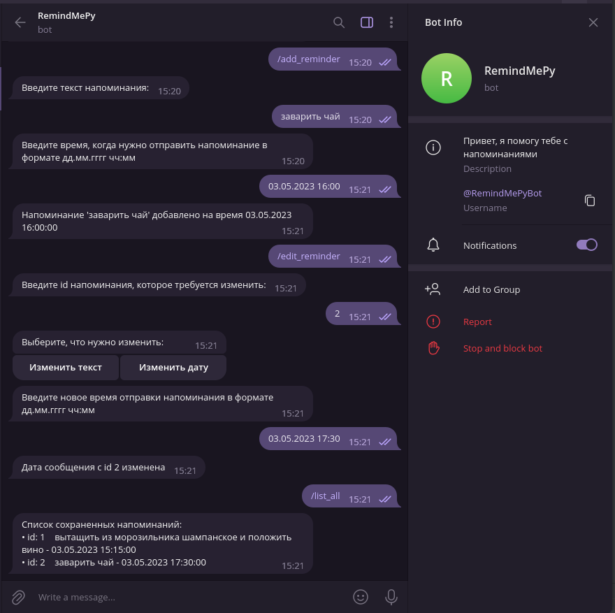

# RemindMePy

Бот для создания напоминаний

https://t.me/RemindMePyBot

## Инструкция по установке

Запросить у https://t.me/BotFather токен для нового бота и вставить его в константу BOT_TOKEN
класса globals в файле проекта RemindMePy/utils/globals 

```
$ git clone git@github.com:tenebrissilvam/RemindMePy.git
$ cd RemindMePy
$ python reminder_bot.py
```
Перейти по ссылке бота и начать работу с ним

Зависимости указаны в файле requirements.txt

## Commands
- [/start]() - начало работы с ботом
- [/help]() - вывод всех команд с пояснениями 
- [/add_reminder]() - добавление напоминания
- [/edit_reminder]() - редактирование напоминания
- [/delete_reminder]() - удаление напоминания
- [/list_all]() - вывод всех текущих напоминаний пользователя


### /start & /help
```/help``` - вывод всех команд с пояснениями 

<p>


### /add_reminder
```/add_reminder``` - добавление напоминания. согласно указаниям бота сначала введите
текст напоминания, затем введите время, когда юот должен вас оповестить

<p>


### /edit_reminder
```/edit_reminder``` - редактирование напоминания. после отправления команды
нужно будет выбрать редактирование текста напоминания или его время

## Редактирование текста

<p>

## Редактирование времени

<p>

### /delete_reminder
```/delete_reminder``` - удаление напоминания. после отправления команды
напоминание будет удалено. если оно еще не успело прийти, то после удаления оно не прийдет

<p>

### /list_all
```/list_all``` - вывод всех напоминаний пользователя. в каждой строке указан id напоминания,
его текст и время напоминания

<p>

## Дополнительно

- После завершения сеанса напоминания не пропадают т.к. сохраняются в базе данных на sqlite3

- Ботом поддерживается работа в групповых чатах. При его подключении к чату все участники могут
создавать, редактировать и просматривать напоминания

<p>


